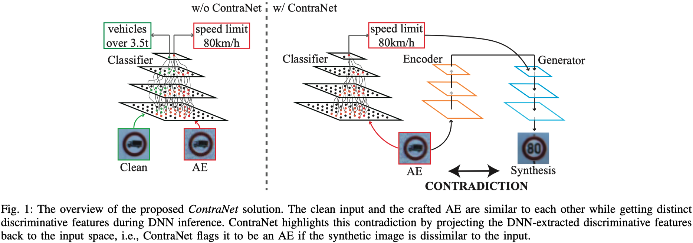

# ContraNet

Official implementation for paper: *What You See is Not What the Network Infers: Detecting Adversarial Examples Based on Semantic Contradiction*. NDSS 2022 [[ArXiv]](https://arxiv.org/abs/2201.09650) [[PDF]](https://arxiv.org/pdf/2201.09650.pdf)



**Abstract**: Adversarial examples (AEs) pose severe threats to the applications of deep neural networks (DNNs) to safety-critical domains, e.g., autonomous driving. While there has been a vast body of AE defense solutions, to the best of our knowledge, they all suffer from some weaknesses, e.g., defending against only a subset of AEs or causing a relatively high accuracy loss for legitimate inputs. Moreover, most existing solutions cannot defend against adaptive attacks, wherein attackers are knowledgeable about the defense mechanisms and craft AEs accordingly.

In this paper, we propose a novel AE detection framework based on the very nature of AEs, i.e., their semantic information is inconsistent with the discriminative features extracted by the target DNN model. To be specific, the proposed solution, namely ContraNet 1 , models such contradiction by first taking both the input and the inference result to a generator to obtain a synthetic output and then comparing it against the original input. For legitimate inputs that are correctly inferred, the synthetic output tries to reconstruct the input. On the contrary, for AEs, instead of reconstructing the input, the synthetic output would be created to conform to the wrong label whenever possible. Consequently, by measuring the distance between the input and the synthetic output with metric learning, we can differentiate AEs from legitimate inputs. We perform comprehensive evaluations under various AE attack scenarios, and experimental results show that ContraNet outperforms existing solutions by a large margin, especially under adaptive attacks. Moreover, our analysis shows that successful AEs that can bypass ContraNet tend to have much-weakened adversarial semantics. We have also shown that ContraNet can be easily combined with adversarial training techniques to achieve further improved AE defense capabilities.

## About this repo

The training code of ContraNet is in `./cifar10_ContraNet`.

The testing code of ContraNet against _white-box_ attacks are in `./whitebox_attacks` and _adaptive attacks_ in `./adaptive_attacks`.

### Prerequisties
Install necessay dependencies listed in `environment.yaml`

### Pretained models

on Google Drive
<div align="center">

  | Datatset | Classifier                                                   | cGAN                                                         | Similarity Measure Model                                     |
| :---: | :---: | :---: | :---: |
| cifar10  | [Densenet169](https://drive.google.com/file/d/1kK-2wlu5xgS-iV6R5cGBG_Zyc7wwD4O9/view?usp=sharing) | [Encoder(E)](https://drive.google.com/file/d/1U5F2UsKSX67mJ-hU4rh1-AZgUXCPDf0G/view?usp=sharing), [Encoder(V)](https://drive.google.com/file/d/1PmGwrB1eODsiQQu8TPad4oskolIoveMY/view?usp=sharing), [Generator](https://drive.google.com/file/d/1PueCACxOCh6-wdiss3BHBL021VjPdCwv/view?usp=sharing) | [dis](https://drive.google.com/file/d/1XOT_kyrJTwbs78vdWMJFNLl2lGoZa9az/view?usp=sharing), [DMM](https://drive.google.com/file/d/19qJdRq05X4vR60y3SLk32X-NYUQkfMM7/view?usp=sharing) |

</div>

## Test ContraNet

### Whitebox Test

Please check [whitebox_attacks](whitebox_attacks) for more details.

### ContraNet against adaptive attacks.

`cd adaptive_attacks`
1. Download pretrained models to `./pretrain`
2. Download classifier `densenet169.pt` to `./`
3. For PGD adaptive attacks, run:
  ```
  python adaptive_targeted_PGD_linf.py \
      [--adaptive_PGD_loss all| ssim_dis_dml| dis_dml| ssim_dis| ssim_dml| dis| dml| ssim]
  ```
4. For ATC+ContraNet against PGD adaptive attacks, run:
```
  python ATC_ContraNet/robust_classifier_adaptive_targeted_PGD_linf.py 
```
5. For OrthogonalPGD attack, run:
```
  python OrthogonalPGD/contraNetattack.py [--fpr 5|50] [--attack_iteration 200|40] \
      [--adaptive_PGD_loss all| ssim_dis_dml| dis_dml| ssim_dis| ssim_dml| dis| dml| ssim]
```
6. ContraNet+ATC against OrthogonalPGD, run:
```
  python OrthogonalPGD/robust_classifier_adaptive_targeted_PGD_linf.py  [--fpr 5|50] \
      [--attack_iteration 200|40] \
      [--adaptive_PGD_loss all| ssim_dis_dml| dis_dml| ssim_dis| ssim_dml| dis| dml| ssim]
```
7. For C&W adaptive attacks, run:
```
  python targeted_cw_adaptive_attack.py
```

## Train ContraNet

` cd cifar10_ContraNet`

1. Train the cGAN component of ContraNet:

   ```
   python adding_noise_main.py 
   ```
   Note that, you may turn off the --resume option if you want to train the model from scratch. After step 1, the basic version of ContraNet's generator part is done. Step 2 aimming to further improve the quality of the synthesis, one may skip this step.
   Our cGAN's implementation is based on [StudioGAN](https://github.com/POSTECH-CVLab/PyTorch-StudioGAN), one may refer to this repo for more instructions.

2. (optional) Train the second discriminator to help the cGAN generating synthesis more faithful to the input image.
   ```
   python mydiscriminator_main.py
   ```
   Once the second discriminator is done, finetune the cGAN model with the obtained second discriminator as an additional objective item by changing the ` adding_noise_worker.py` to `worker_train_d2D.py`. Then run:
   ```
   python adding_noise_main.py
   ```

3. Train the Dis component in the similarity measurement model.
   ```
   python noisecGAN_adding_bengin_noise_augmentation_using_discrimator_as_dml.py
   ```
 4. Train the DMM component in the similarity measurement model. Please check [whitebox_attacks](whitebox_attacks) for more details

## Cite ContraNet

If you find this repository useful for your work, please consider citing it as follows:

```bibtex
@inproceedings{Yang2022WhatYS,
  title     = {What You See is Not What the Network Infers: Detecting Adversarial Examples Based on Semantic Contradiction},
  author    = {Yang, Yijun and Gao, Ruiyuan and Li, Yu and Lai, Qiuxia and Xu, Qiang},
  booktitle = {Network and Distributed System Security Symposium (NDSS)},
  year      = {2022}
}
```

Please remember to cite all the datasets and backbone estimators if you use them in your experiments.
